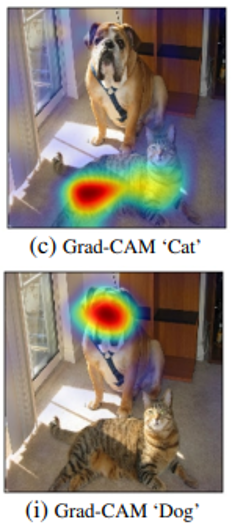

Blog Report Cross-Framework-Introspection
---

# Introduction

Over the last years, neural networks have grown ever the more powerful and complex. Their structure allows them to be
adapted for a wide range of tasks in which the can provide great results.

One of their caveats however is the limited insight into how these results emerge. For most human users, the inside of a
neural network is little more than a blackbox which turns input data into, e.g., a classification or prediction.

This is a problem for many use cases. Starting with developers who want to improve their model's performance and need a
detailed understanding of the workings of each component in order to make the right changes. Up to end users in critical
settings, such as decision making in medicine, who have to verify a model's results and rely on adequate explanations to
draw the right conclusions.

Different methods, called introspection methods, have been developed to counteract this problem. They try to explain a
networks's behaviour either by attributing the results to certain parts of input or the network itself or alternatively
by visualizing features a network has learned. An example for the first case is the Grad-CAM method which allows to
visualize the contribution of different parts in the input toward a classification (see [Figure 1a](#figure1a)). Feature
visualization on the other hand can be achieved by optimizing a randomized input towards a certain goal such as
activating a particular neuron (see [Figure 1b](#figure1b)).

Figure 1a: Grad-CAM for the classes 'cat' and 'dog'. Source: <a href="#selvaraju2017">Selvaraju et al., 2017</a>

Figure 1b: Feature Visualization for a single neuron using existing images (top) and optimization. Source: <a href="#olah2017">(Olah et al., 2017)</a>

For the users' convenience, implementations of many of these methods have been packaged and made publicly available in
toolsets like [Captum](https://captum.ai/) or [tf-keras-vis](https://github.com/keisen/tf-keras-vis). One limitation of
these preimplemented introspection methods is that they depend on a specific framework
like [PyTorch](https://pytorch.org/) or [TensorFlow](https://www.tensorflow.org/).

In practice, this may lead to situations like the following:
Imagine you have trained a model in TensorFlow and now want to apply the attribution method Integrated
Gradients [(Sudararajan, 2017)](#sundararajan2017) to it. You find out that this particular method is already
implemented in Captum, a PyTorch toolset, but not in the TensorFlow toolset tf-keras-vis. This means you have three
options: Rebuild your model in PyTorch so you can use the PyTorch toolset, implement the method yourself or not don't
use the method at all.

None of these options are optimal. It would be better by far to instead have a forth option that lets you use the
already existing Integrated Gradients implementation independent of the framework it was implemented in. Realising this
option is the idea behind Cross-Framework Introspection.

To achieve this, we have built a tool that acts as an interface between the user and the introspection methods. The user
just puts in their model and their favoured introspection method. Based on that, the tool selects an implementation,
and, if the framework of the model does not fit the implementation's framework, it translates the model and additional
arguments into the right framework. Finally, it executes the introspection method and returns the result.

Concretely, the tool supports methods from tf-keras-vis and Captum, but has also been designed to be extended to other
toolsets if needed.

In the following, we will describe the mentioned introspection toolset and the different components of the translation
process between PyTorch and TensorFlow. Afterwards, we will describe the tool's structure and functionality in more
detail. Finally, we will evaluate the tool and use it to compare different implementations of the same introspection
methods.

# Supported Toolsets

The goal of cross-framework introspection is to connect models and introspection methods from different frameworks.
Since TensorFlow, more precisely Tensorflow 2.0, and PyTorch are currently the most used machine learning frameworks,
methods and models from at least these two frameworks should be supported. Therefore, we have chosen one toolset from
each framework, Captum from PyTorch and tf-keras-vis from TensorFlow. We will take a closer look at them in the
following:

## Captum
todo
- [(Narine et al., 2020)](#narine2020)
- open source, extendable, generic
- input / layer / neuron attribution
- gradient vs pertubation based
- not only applicable to image tasks
-

## tf-keras-vis

## Method selection

Especially Captum implements a large number of methods, 36 in total counting primary, layer and neuron variants
seperately. In order to limit the scope of this project, I have chosen prioritize the introspection methods provided by
Captum and tf-keras-vis. The result can be seen in the table below.

| Method  | Category  | Priority  |
| --- | --- | --- |
| **Captum** |||
| Integrated Gradients  |    primary, layer, neuron  | include |
| Saliency  | primary | include |
| DeepLift  | primary, layer, neuron  | include |
| DeepLiftShap  | primary, layer, neuron  | leave out |
| GradientShap  | primary, layer, neuron  | later |
| Input X Gradient  | primary | include |
| Gradient X Activation | layer | include |
| Guided Backpropagation    | primary, neuron | leave out |
| Guided GradCAM  | primary | leave out |
| Deconvolution | primary, neuron | later |
| Feature Ablation  | primary, layer, neuron  | include |
| Occlusion | primary  | leave out |
| Feature Permutation | primary | include |
| Shapley Value Sampling  | primary | leave out |
| Lime  | primary | leave out |
| KernelShap  | primary | leave out |
| Layer Relevance Propagation | primary, layer  | leave out | 
| Conductance | layer, neuron | later |
| Layer Activation  | layer | later |
| Internal Influence  | layer | leave out |
| GradCAM | layer | include |
| Neuron Gradient | neuron  | later |
| **tf-keras-vis** |||	
| Activation Maximization | feature visualization | include |
| Vanilla Saliency / SmoothGrad | attribution | include |
| GradCAM | attribution | include |
| GradCAM++ | attribution | later |
| ScoreCAM  | attribution | later |
| LayerCAM  | attribution | later |

_Include_ marks methods which are important and were implemented right away. These methods have also been used for
the [evaluation](#evaluation) Methods marked as _later_ are considered to be useful, but not essential to the project.
Those methods are implemented as well, but not part of the evaluation.
_Leave out_ is used for methods which are deemed not important for this project and thusly are not integrated into the
tool.

The aim of this selection is to capture a wide range of different approaches, for instance including both gradient-based
and perturbation-based methods. This also means that of similar method pairs like Feature Ablation and Occlusion,
usually only one method is included. Basic, often-used methods are given an advantage compared to more specialized ones
as well. For this reson, GradCAM for example has a higher priority than the GradCAM variants. Additionally, methods
which are known to fail sanity checks (todo cite) such as Guided Backpropagation have been excluded.

# Cross-Framework Introspection

To accomplish the task of making the selected methods from Captum accessible in TensorFlow and the tf-keras-vis methods
accessible in PyTorch we need a tool that has the following features:

- **Model translation from PyTorch to TensorFlow:** todo: add paragraphs
- **Model translation from TensorFlow to PyTorch**
- **Data Translation**
- **Interface for accessing introspection methods**

Beside these strictly neccessary features, there are a few additionally requirements for the tool:

- **Extendability**
- **Uniform interface**
- **Error handling**
- **Plotting of results**

To achieve these goals, we have decided on the structure shown in [Figure 2](#figure2).

Figure 2: Internal and external components of the cross-framework introspection tool.

First, let's take a look at the external components shown on the lefthand side. These are required as part of the
translation process. Models are translated between PyTorch and TensorFlow via an indermediate representation,
the [Open Neural Network Exchange](https://onnx.ai/) (ONNX) format. ONNX has been developed specifically to be
interoperable with a wide range of different frameworks including PyTorch and TensorFlow. Another advantage are the
already existing libraries for conversion of models between ONNX and other frameworks, four of which are used here:
**[torch.onnx](https://pytorch.org/docs/stable/onnx.html)** is part of PyTorch and converts models from PyTorch to ONNX.
These ONNX models are subsequentially converted to the TensorFlow Keras format
by **[onnx2keras](https://github.com/AxisCommunications/onnx-to-keras)**, a library developed
by [Axis Communications](https://www.axis.com/). However, because some changes were neccessary to fit this library into
the translation process, we are using a [forked version](https://github.com/sfluegel05/onnx-to-keras/tree/dev) of
onnx2keras.

This choice differs from the original project plan to use the [onnx-tensorflow](https://github.com/onnx/onnx-tensorflow)
library provided by ONNX. However, it turned out that the output of onnx-tensorflow is not compatible with the
introspection methods. Instead of a regular TensorFlow model, onnx-tensorflow returns a `SavedModel` instance which can
incorporates basic functions of a TensorFlow model, but not the full functionality required by Captum methods. Another
candidate for the ONNX to TensorFlow conversion was the [onnx2keras](https://github.com/gmalivenko/onnx2keras) library
developed by Grigory Malivenko. It got rejected because it was incompatible with the ONNX models produced by torch.onnx.
I In particular, layer names which include certain special character, such as `onnx::Relu_10/`, could neither be handled
by this onnx2keras library, nor efficiently changed beforehand.

For the translation process from Tensorflow to PyTorch, we employ **[
tensorflow-onnx](https://github.com/onnx/tensorflow-onnx)**, a library directly provided by ONNX, and **[
onnx2torch](https://pypi.org/project/onnx2torch/)**, which has been developed by [**enot.ai**](https://enot.ai/). All
mentioned libraries are accessible open-source.

Regarding the internal structure, note that the translation classes, as well as methods and toolsets have abstract
superclasses which provide an interface to the other functions. This ensures the tool's extensibility, since new
methods, toolsets or even complete frameworks can be added as new subclasses with minimal additional effort.

Now, let's take a look at how these components work together when a user wants to execute an introspection method with a
model from an incongruous framework, i.e., a user executes a method call like the following:

    attribute(torch_model, method_key='grad_cam', toolset='tf-keras-vis', init_args={'layer': torch_model.conv2}, exec_args={'score': CategoricalScore(mnist_y.tolist()), 'seed_input': mnist_x, 'normalize_cam': False})

Note that the user specifically requests a tf-keras-vis method, but gives the tool a PyTorch model. How this or similar
calls are handled is described in [Figure 3](#fig:activity_diagram).

todo: update figure

- in header: visualize_features()
- determine model framework: exception if no framework matches

First, all methods matching the provided `method_key` have to be retrieved. This is either done via one of the toolset
classes or, if the `toolset` parameter is not provided, methods from all toolset classes are taken into account. If no
method for the given `method_key` is found, an exception is raised. If multiple methods are found, a warning is put out
and one method is selected, with priority given to methods requiring no model translation. This can happen if the same
introspection method is implemented in different toolsets, but the user didn't specify a toolset.

Next, the tool checks if all required arguments for the selected introspection method are present and raises an
exception if not. After that, it aligns the input model and data with the selected method. For this, first, it is
checked if the model belongs to one of the known frameworks (either TensorFlow or PyTorch). If it belongs to none, an
exception is raised.

Otherwise, if the model framework is not the one required by the introspection method, the model is translated
accordingly. The input data for the introspection method (`init_args` and `exec_args`) is translated in the same way.

Another special case is a missing `layer` argument. Unlike other missing arguments, this does not lead to an exception.
This is because for Captum's Layer and Neuron methods, the layer of the (PyTorch) model has to be provided as an input
and since the layer structure of TensorFlow models differs from their PyTorch translation, this might not be possible to
provide when calling `attribute()` for the first time. Thus, the model gets translated and returned to the user
alongside a list of available layers. The user can then choose a layer and call another
method, `finish_execution_with_layer()` to resume the process.

Finally, the translated model and arguments are given to the introspection method and the result is return. Optionally,
a plot of the results is created as well.

Figure 3: The process for executing an introspection method with different parameters.

notes:
- goals
- tool implementation (component / activity diagram?)
- relevant projects: onnx (torch.onnx, tf-onnx), onnx2keras, onnx2torch, tf-keras-vis, Captum
- refer to documentation for implementation details / usage
eval:
- clever hans results
- activation maximization
- framework comparison
- tool limitations

# Evaluation

## Clever Hans

In order to evaluate if the results gained from executing an introspection method on a translated model actually yield
useful insights into the original model, we trained a CNN model (todo: link) on a modified MNIST
dataset ([LeCun et. al., 1998](#lecun1998)) with permutated labels and 5x5 grey squares in the top left corner, their
lightness correlating with the newly assigned label. This way, we can safely assume that the model only learns to use
the top left corner when making a prediction.

We then used the trained model to test different attribution methods. For the Captum methods, the model has been
implemented and trained in TensorFlow and for the tf-keras-vis methods in PyTorch.

The results for the primary attribution methods can be seen in [Figure 4](#fig:clever_hans). As can be seen, most
methods indicate a strong focus of the network of the top left corner. (todo: why not tf-keras-vis gradcam?)
[Figure 5](#fig:clever_hans_layer) shows the results of layer attribution methods for the first convolutional layer.
Here, out of 20 channels, some are only react to the to top left corner (such as channels 16 and 18) while some show a
random behaviour (like channel 19) or no activation at all.

Figure 4: A modified MNIST image where the label depends on the square in the top left corner and the results of different attribution methods applied to a CNN and this image.

Figure 5: The outputs of different Captum Layer attribution methods for the first convolution layer of our CNN. The same input picture was used as in <a href="#fig:clever_hans">Figure 4</a>. Only 4 out of 20 channels are shown in this grafic.

Overall, these results indicate that the translation of models between PyTorch and TensorFlow doesn't interfere with the
introspection methods' abilities to correctly attribute activations. This goes both for primary methods using the whole
model as well as for methods working for a certain layer (or neuron in that layer).

## Comparison between Toolsets

Another interesting use case for Cross-Framework Introspection is comparing implementations of the same methods in
different frameworks. Since we can translate models between frameworks, we can apply implementations from Captum and
tf-keras-vis to the same model. Specifically, we have compared the implementations of GradCAM and Saliency with models
from both PyTorch and Tensorflow, since these methods are implemented in both toolsets.

### Saliency

Saliency Maps ([Simonyan, 2013](#simonyan2013)) are a basic visualization method for neural networks which use the
gradient of the class score with regard to the input image.

For our purposes, we trained both a TensorFlow and a PyTorch model on the MNIST dataset and applied the Saliency
implementations of Captum and tf-keras-vis to them.
[Figure 6](#fig:comparison_saliency) shows the results for one input image. For both models, the results from Captum and
tf-keras-vis are nearly equal when additional parameters are used (see last row, columns 1 and 3). The additional
parameters have been deliberately in a way that results in similary results for both implementation. The remaining
difference, which is several orders of magnitude lower than the method output, can be attributed to minor numerical
differences resulting from the model translation process. If the default parameters are used, the difference between the
Captum and tf-keras-vis results is significantly larger (see columns 2 and 4). This happens because tf-keras-vis has
a `normalize_map` parameter that defaults to `true`, which scales the Saliency Map to values between 0 and 1.

Figure 6: The results of the Captum and tf-keras-vis Saliency implementations for the input image shown at the top. The difference between both implementations is plotted in the bottom row. The columns show (from left to right): TF model and methods with additional parameters, TF model and methods with default parameters, Torch model and methods with additional parameters, Torch model and methods with default parameters.

### GradCAM

Gradient-weighted Class Activation Mapping (Grad-CAM) ([Selvaraju, 2017](#selvaraju2017)) is an attribution method for
CNNs which measures the importance of values in the feature space towards a certain target class.

As we did for the Saliency methods, we compared the implementations of the Captum and tf-keras-vis GradCAM methods on
both TensorFlow and PyTorch models. For each model, [Figure 7](#fig:comparison_gradcam) shows the results with
additional parameters chosen in order to align the results from both implementations, with additional parameters and
scaling to the input size and with default parameters. The results show, as they did for Saliency, that the difference
between both implementations is negligible if the parameters are set accordingly, but not with default parameters. These
differences mainly stem from tf-keras-vis' `normalize_map` option and from Captum's `relu_attributions` parameter that
is `False` by default and has to be set to `True` for Captum to apply a ReLU to the result as it was done in the
original paper describing GradCAM.

The scaling of images to the original input size is a common feature for GradCAM implementations since it allows to
superimpose a heatmap directly on input images. However, Captum and tf-keras-vis implement this differently:
Tf-keras-vis uses an `expand_cam` flag that is `True` by default and interpolates the images. Captum has an additional
method that can be applied to the GradCAM output and upsamples the output the the desired size, but applies no
interpolation.

Figure 7: The results of the Captum and tf-keras-vis GradCAM implementations for the input image shown at the top. The difference between both implementations is plotted in the bottom row. The columns show (from left to right): TF model and methods with additional parameters, with additional parameters including scaling options and with default parameters (with scaling), Torch model and methods with additional parameters, with additional parameters including and with default parameters (with scaling).

# Conclusion

todo

# Bibliography

- 
<a href="https://distill.pub/2017/feature-visualization/">Chris Olah, Alexander Mordvintsev, Ludwig Schubert: Feature Visualization, Distill, 2017</a>

- 
<a href="https://arxiv.org/abs/1703.01365">Mukund Sundararajan, Ankur Taly, Qiqi Yan: Axiomatic Attribution for Deep Networks, arXiv, 2017</a>

- 
<a href="https://arxiv.org/abs/2009.07896">Kokhlikyan et al.: Captum: A Unified and Generic Model Interpretability Library for PyTorch, arXiv, 2020</a>

- 
<a href="https://ieeexplore.ieee.org/abstract/document/726791/?casa_token=Fi4h9S8m7YIAAAAA:PcPAnKGFtj9Y-iO0O9To9Ka0q3uQf0iaVS9SYGHU3DjQb1BEpXlh0Tv5AvNWE0yykgLk5wi54A">Yann LeCun et al.: Gradient-based Learning Applied to Document Recognition, IEEE, 1998</a>

- 
<a href="https://arxiv.org/abs/1312.6034">Karen Simonyan, Andrea Vedaldi, Andrew Zisserma: Deep Inside Convolutional Networks: Visualising Image Classification Models and Saliency Maps, arXiv, 2013</a>

- 
<a href="https://openaccess.thecvf.com/content_iccv_2017/html/Selvaraju_Grad-CAM_Visual_Explanations_ICCV_2017_paper.html">Ramprasaath R. Selvaraju et. al.: Grad-CAM: Visual Explanations From Deep Networks via Gradient-Based Localization, Proceedings
  of the IEEE International Conference on Computer Vision (ICCV), 2017</a>
