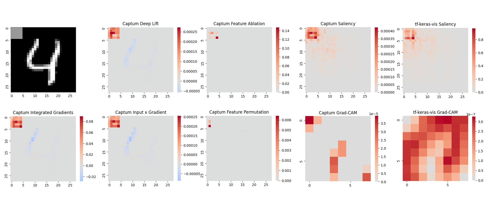
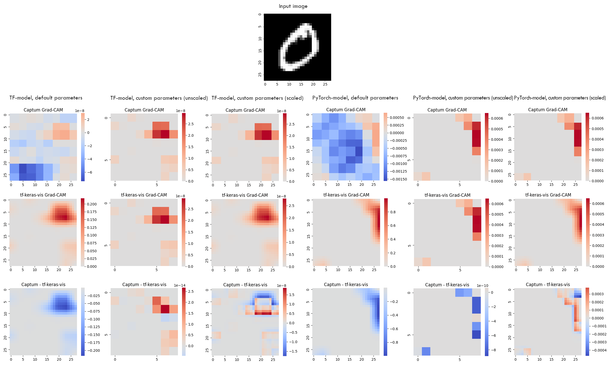

Blog Report Cross-Framework-Introspection
---

# Introduction

Over the last years, neural networks (NNs) have grown ever more powerful and complex. Their structure allows them to be
adapted for a wide range of tasks in which they can provide great results, such as image
classification ([Krizhevsky et al., 2017](#krizhevsky2017)), machine
translation ([Bahdanau et al., 2014](#bahdanau2014)) and speech recognition ([Dahl et al., 2011](#dahl2011)).

One of their caveats however is the limited insight into how these results emerge. For most human users, the inside of a
neural network is little more than a blackbox which turns input data into, e.g., a classification or prediction.

This is a problem for many use cases. Starting with developers who want to improve their model's performance and need a
detailed understanding of the workings of each component in order to make the right changes, up to end users in critical
settings, such as decision making in medicine, who have to verify a model's results and rely on adequate explanations of
the results to draw the right conclusions.

Different algorithms, called introspection methods, have been developed to counteract this
problem ([Sundarajan et al., 2017](#sundararajan2017), [Shrikumar et al., 2017](#shrikumar2017)
, [Fisher et al., 2020](#fisher2020)). They try to explain and visualise a networks's behaviour either by attributing
the results to certain parts of either the input or of the network itself or alternatively by visualising features a
network has learned. An example for attribution is the Grad-CAM method which allows to visualise the contribution of
different parts in the input toward a classification (
see [Figure 1a](#figure1a)). Feature visualisation on the other hand can be achieved by optimising an input towards a
certain goal such as activating a particular neuron (see [Figure 1b](#figure1b)).

Figure 1a: Grad-CAM for the classes 'cat' and 'dog'. Source: <a href="#selvaraju2017">Selvaraju et al., 2017</a>

 

Figure 1b: Feature Visualisation for a single neuron using existing images (left) and optimisation. Source: <a href="#olah2017">Olah et al., 2017</a>

 

For users' convenience, implementations of many of these methods have been packaged and made publicly available in
toolsets like [Captum](https://captum.ai/) or [tf-keras-vis](https://github.com/keisen/tf-keras-vis). These libraries
save users the effort of implementing all methods by themselves and make it easy to switch between and compare different
methods. One limitation of these preimplemented introspection toolsets however is that they are bould to a specific
model framework, e.g. [PyTorch](https://pytorch.org/) or [TensorFlow](https://www.tensorflow.org/).

In practice, this may lead to situations like the following:
Imagine you have trained a model in TensorFlow and now want to apply the attribution method Integrated
Gradients ([Sudararajan, 2017](#sundararajan2017)) to it. You find out that this particular method is already
implemented in Captum, a PyTorch toolset, but not in the TensorFlow toolset tf-keras-vis. This means that the only way
to use your desired method is to transform your TensorFlow model into an equivalent PyTorch model.

Since performing this manually requires a lot of effort, we have build a tool, called **MetaNNvis**, that automates this
process.

MetaNNvis acts as an interface between the user and the introspection methods. The user just puts in their model and
their favoured introspection method. Based on that, the tool selects an implementation, and, if the framework of the
model does not fit the implementation's framework, it translates the model and additional arguments into the right
framework. Finally, it executes the introspection method and returns the result.

Currently, the tool supports methods from tf-keras-vis and Captum, but has also been designed to be extendable to other
toolsets if needed.

In the following, we will first introduce the supported introspection toolsets. Afterwards, we will describe the tool's
features and functionality in more detail (Section [MetaNNvis Implementation](#metannvis-implementation)). Finally, we
will evaluate the tool and use it to compare different implementations of the same introspection methods (Section [Evaluation](#evaluation)).

# Supported Introspection Techniques

The goal of this project is to connect models and introspection methods from different frameworks. Since TensorFlow,
more precisely Tensorflow 2.x, and PyTorch are currently the most used machine learning frameworks, the interaction
between models and methods from these two frameworks is the most interesting application for our approach. Therefore, we
have chosen one toolset for each framework, Captum from PyTorch and tf-keras-vis from TensorFlow. We will take a closer
look at them in the following.

## Captum

Captum [(Narine et al., 2020)](#narine2020) is a generic interpretability library for PyTorch models. It features
implementations of various attribution methods, which it divides into primary, layer and neuron methods, meaning that
methods are measuring the importance of either the input, a model layer or a particular neuron. Additionality, Captum
provides evaluation metrics and a visualisation tool for these methods. The library can be applied to different
NN-tasks, including classification and non-classification models as well as different input modalities. Captum is
open-source and built to be extendable by new algorithms.

## tf-keras-vis

The open-source library [tf-keras-vis](https://github.com/keisen/tf-keras-vis) contains visualisation methods for
TensorFlow 2.x models. It supports both feature visualisation with activation maximisation as well as attribution
methods, more precisely saliency maps and different variants of class activation maps. tf-keras-vis has been developed
for image inputs and has been designed to be light-weight and flexible.

## Method selection

Especially Captum implements a large number of methods: 36 in total, counting primary, layer and neuron variants
seperately. In order to limit the scope of this project, we have chosen prioritise the introspection methods provided by
Captum and tf-keras-vis.

One criterion is to capture a wide range of different approaches, for instance including both gradient-based and
perturbation-based methods. This also means that of similar method pairs like Feature Ablation and Occlusion, usually
only one method is included. Basic, often-used methods are being preferred over more specialised ones as well. For this
reson, GradCAM for example has a higher priority than the GradCAM variants. Additionally, methods which are known to
fail sanity checks ([Adebayo et al., 2018](#adebayo2018); [Sixt et al., 2020](#sixt2020)) such as Guided Backpropagation
have been excluded.The result can be seen in the table below.

<table>
    <tr>
        <th>Method</th>
        <th>Category</th>
        <th>Priority</th>
    </tr>
    <tr>
        <th class="toolset-header" style="border-top: 2px solid; border-bottom: 2px solid; text-align: center;" colspan=3>Captum</th>
    </tr>
    <tr>
        <td>Integrated Gradients</td>
        <td>primary, layer, neuron</td>
        <td style="text-align: center">1</td>
    </tr>
    <tr>
        <td>Saliency</td>
        <td>primary</td>
        <td style="text-align: center">1</td>
    </tr>
    <tr>
        <td>DeepLift</td>
        <td>primary, layer, neuron</td>
        <td style="text-align: center">1</td>
    </tr>
    <tr>
        <td>DeepLiftShap</td>
        <td>primary, layer, neuron</td>
        <td style="text-align: center">3</td>
    </tr>
    <tr>
        <td>GradientShap</td>
        <td>primary, layer, neuron</td>
        <td style="text-align: center">2</td>
    </tr>
    <tr>
        <td>Input X Gradient</td>
        <td>primary</td>
        <td style="text-align: center">1</td>
    </tr>
    <tr>
        <td>Gradient X Activation</td>
        <td>layer</td>
        <td style="text-align: center">1</td>
    </tr>
    <tr>
        <td>Guided Backpropagation</td>
        <td>primary, neuron</td>
        <td style="text-align: center">3</td>
    </tr>
    <tr>
        <td>Guided GradCAM</td>
        <td>primary</td>
        <td style="text-align: center">3</td>
    </tr>
    <tr>
        <td>Deconvolution</td>
        <td>primary, neuron</td>
        <td style="text-align: center">2</td>
    </tr>
    <tr>
        <td>Feature Ablation</td>
        <td>primary, layer, neuron</td>
        <td style="text-align: center">1</td>
    </tr>
    <tr>
        <td>Occlusion</td>
        <td>primary</td>
        <td style="text-align: center">3</td>
    </tr>
    <tr>
        <td>Feature Permutation</td>
        <td>primary</td>
        <td style="text-align: center">1</td>
    </tr>
    <tr>
        <td>Shapley Value Sampling</td>
        <td>primary</td>
        <td style="text-align: center">3</td>
    </tr>
    <tr>
        <td>Lime</td>
        <td>primary</td>
        <td style="text-align: center">3</td>
    </tr>
    <tr>
        <td>KernelShap</td>
        <td>primary</td>
        <td style="text-align: center">3</td>
    </tr>
    <tr>
        <td>Layer Relevance Propagation</td>
        <td>primary, layer</td>
        <td style="text-align: center">3</td>
    </tr>
    <tr>
        <td>Conductance</td>
        <td>layer, neuron</td>
        <td style="text-align: center">2</td>
    </tr>
    <tr>
        <td>Layer Activation</td>
        <td>layer</td>
        <td style="text-align: center">2</td>
    </tr>
    <tr>
        <td>Internal Influence</td>
        <td>layer</td>
        <td style="text-align: center">3</td>
    </tr>
    <tr>
        <td>GradCAM</td>
        <td>layer</td>
        <td style="text-align: center">1</td>
    </tr>
    <tr>
        <td>Neuron Gradient</td>
        <td>neuron</td>
        <td style="text-align: center">2</td>
    </tr>
    <tr>
        <th class="toolset-header" style="border-top: 2px solid; border-bottom: 2px solid; text-align: center;" colspan=3>tf-keras-vis</th>
    </tr>
    <tr>
        <td>Activation Maximization</td>
        <td>feature visualisation</td>
        <td style="text-align: center">1</td>
    </tr>
    <tr>
        <td>Vanilla Saliency / SmoothGrad</td>
        <td>attribution</td>
        <td style="text-align: center">1</td>
    </tr>
    <tr>
        <td>GradCAM</td>
        <td>attribution</td>
        <td style="text-align: center">1</td>
    </tr>
    <tr>
        <td>GradCAM++</td>
        <td>attribution</td>
        <td style="text-align: center">2</td>
    </tr>
    <tr>
        <td>ScoreCAM</td>
        <td>attribution</td>
        <td style="text-align: center">2</td>
    </tr>
    <tr>
        <td>LayerCAM</td>
        <td>attribution</td>
        <td style="text-align: center">2</td>
    </tr>
</table>

_Priority 1_ marks methods which are important and were implemented right away. These methods have also been used for
the [evaluation](#evaluation). Methods marked as _priority 2_ are considered to be useful, but not essential to the
project. Those methods are implemented as well, but are not part of the evaluation.
_Priority 3_ is used for methods which are deemed not important to this project and thus are not integrated into the
tool.

# MetaNNvis Implementation

## Requirements

To accomplish the task of making the selected methods from Captum accessible in TensorFlow and the tf-keras-vis methods
accessible in PyTorch, MetaNNvis has to have the following features:

- **Model translation between PyTorch and TensorFlow**: The tool's most crucial component is the ability to transform a
  PyTorch model into a TensorFlow model and vice versa. The translated model should behave equivalent to the original
  model, i.e., yield the same results for the same inputs. This way, we can assume that any introspection results we get
  for the translated model are also true for the original model.
- **Data Translation**: Many introspection methods require not only a model, but also additional data, e.g., an input
  image for which to compute the saliency. Since users typically have model input data available in a format that
  matches their model's framework, but not the framework of the translated model, input data needs to be transformed as
  well. Besides that, the tool should also be able to accept data in the target framework's or in an independent format.
- **Interface for accessing introspection methods**: Finally, the tool has to pass the translated model and input data
  to the introspection method itself and return the results. This also includes passing additional parameters for
  finetuning the introspection method.

Beside these strictly neccessary features, there are a few additional requirements for the tool:

- **Extendability**: Since we decided to cover only a limited number of methods from two toolsets, it might become
  necessary to add new methods later on. Therefore, MetaNNvis should have a design which allows adding not only more
  tf-keras-vis and Captum methods, but also new toolsets or even complete frameworks.
- **Uniform interface**: Different toolsets and frameworks always have a differently structured API. When working with
  methods from different toolsets simultaneously, this can become cumbersome. To improve the user experience, the tool
  should provide a single interface for all toolsets that hides most of the differences.
- **Error handling**: Errors which may occur during any part of the process, for instance during model translation or
  calling the introspection method itself, should be avoided or caught where possible.
- **Plotting of results**: The results of introspection methods are typically multi-dimensional arrays which need to be
  visualised to be human-understandable. This is a task which can be provided by the tool as well.

## Components

To achieve these goals, we have decided on the structure shown in [Figure 2](#figure2).

Figure 2: Internal and external components of MetaNNvis.

 

First, let's take a look at the external components shown on the lefthand side. These are required as part of the
translation process. Models are translated between PyTorch and TensorFlow via an intermediate representation,
the [Open Neural Network Exchange](https://onnx.ai/) (ONNX) format. ONNX has been developed specifically to be
interoperable with a wide range of different frameworks including PyTorch and TensorFlow. Another advantage are the
already existing libraries for conversion of models between ONNX and other frameworks, four of which are used here:
**[torch.onnx](https://pytorch.org/docs/stable/onnx.html)** is part of PyTorch and converts models from PyTorch to ONNX.
These ONNX models are subsequentially converted to the TensorFlow Keras format
by **[onnx2keras](https://github.com/AxisCommunications/onnx-to-keras)**, a library developed
by [Axis Communications](https://www.axis.com/). However, because some changes were neccessary to fit this library into
the translation process, we are using a [forked version](https://github.com/sfluegel05/onnx-to-keras/tree/dev) of
onnx2keras.

This choice differs from the original project plan to use the [onnx-tensorflow](https://github.com/onnx/onnx-tensorflow)
library provided by ONNX because it turned out that the output of onnx-tensorflow is not compatible with the
introspection methods. Instead of a regular TensorFlow model, onnx-tensorflow returns a `SavedModel` instance which
incorporates basic functions of a TensorFlow model, but not the full functionality required by Captum methods. Another
candidate for the ONNX to TensorFlow conversion was the [onnx2keras](https://github.com/gmalivenko/onnx2keras) library
developed by Grigory Malivenko. It got rejected because it was incompatible with the ONNX models produced by torch.onnx.
In particular, layer names which include certain special character, such as `onnx::Relu_10/`, could neither be handled
by this onnx2keras library, nor efficiently changed beforehand.

For the translation process from Tensorflow to PyTorch, we employ **[
tensorflow-onnx](https://github.com/onnx/tensorflow-onnx)**, a library directly provided by ONNX, and **[
onnx2torch](https://pypi.org/project/onnx2torch/)**, which has been developed by [**enot.ai**](https://enot.ai/). All
mentioned libraries are accessible open-source.

Regarding the internal structure, note that the translation classes, as well as methods and toolsets have abstract
superclasses which provide an interface to the other functions. This ensures the tool's extendability, since new
methods, toolsets or even complete frameworks can be added as new subclasses with minimal additional effort.

## Workflow

Now, let's take a look at how these components work together when a user wants to execute an introspection method with a
model from an incongruous framework, i.e., a user executes a method call like the following:

    attribute(torch_model, method_key='grad_cam', toolset='tf-keras-vis', 
              init_args={'layer': torch_model.conv2}, 
              exec_args={'score': CategoricalScore(mnist_y.tolist()), 
                         'seed_input': mnist_x, 
                         'normalize_cam': False
                        }
    )

Note that the user specifically requests a tf-keras-vis method, but gives the tool a PyTorch model. Thus, even if a
Grad-CAM implementation is available in PyTorch, the tool has to select the TensorFlow implementation. How this or
similar calls are handled is described in [Figure 3](#fig:activity_diagram).

First, all methods matching the provided `method_key` have to be retrieved. This is either done via one of the toolset
classes or, if the `toolset` parameter is not provided, methods from all toolset classes are taken into account. If no
method for the given `method_key` is found, an exception is raised. If multiple methods are found, a warning is put out
and one method is selected, with priority given to methods requiring no model translation. This can happen if the same
introspection method is implemented in different toolsets, but the user didn't specify a toolset.

Next, MetaNNvis checks if all required arguments for the selected introspection method are present and raises an
exception if not. After that, it aligns the input model and data with the selected method. For this, first, it is
checked if the model belongs to one of the known frameworks (either TensorFlow or PyTorch). If it belongs to none, an
exception is raised.

Otherwise, if the model framework is not the one required by the introspection method, the model is translated
accordingly. The input data for the introspection method (`init_args` and `exec_args`) is translated in the same way.

Another special case is a missing `layer` argument. This argument is used for Captum's Layer and Neuron methods, where
layer of the (PyTorch) model has to be provided as an input to the attribution function. But since the layer structure
of TensorFlow models differs from their PyTorch translation, it is not always possible to providing a correct layer
identifier when calling `attribute()` for the first time. Thus, instead of raising an exception, as it would for other
missing arguments, the tool translates the model and returns the translated model to the user alongside a list of
available layers. The user can then pick a layer and call another method, `finish_execution_with_layer()` with an
identifier for the chosen layer and the translated model to resume the process.

Finally, the translated model and arguments are given to the introspection method and the result is returned.
Optionally, a plot of the results is created as well.

Figure 3: The process for executing an introspection method with different parameters.

 

Instructions on how to install and use MetaNNvis can be found in
the [User Guide](https://github.com/sfluegel05/metaNNvis/blob/main/results/user_guide.ipynb). It also contains
information on how to extend the tool with your own introspection methods.

## Model Limitations

Not all PyTorch and Tensorflow models are fully supported by MetaNNvis. This is due to the fact that the model
translation process relies on several libraries which each don't support all of the operations theoretically available
in PyTorch and Tensorflow models. Instead, they focus on a subset of operations which they deem the most relevant.

Concretely, this means that the PyTorch-Tensorflow translation is dependent on torch.onnx and onnx2keras, with
onnx2keras being the more restrictive part of the process. The limitations of torch.onnx are listed in
its [documentation](https://pytorch.org/docs/stable/onnx.html#limitations) and the operations supported by onnx2keras
can be inferred from the [source code](https://github.com/AxisCommunications/onnx-to-keras/blob/master/onnx2keras.py).
It is however possible to add support for new operations to both libraries if needed as we did for the `log_softmax`
operation in onnx2keras (see [this pull request](https://github.com/AxisCommunications/onnx-to-keras/pull/44))

The Tensorflow-PyTorch translation depends on tensorflow-onnx and onnx2torch, which both provide lists of supported
operators ([tensorflow-onnx](https://github.com/onnx/tensorflow-onnx/blob/main/support_status.md)
, [onnx2torch](https://github.com/ENOT-AutoDL/onnx2torch/blob/main/operators.md)). If needed, support for additional
operators can be added to these libraries as well.

# Evaluation

We have evaluated our tool's functionality in three parts:
First of all, we have verified that the model translation works correctly (see [Model Translation](#model-translation)).
Furthermore, we evaluated whether the methods themselves yield expectable results for a simple clever hans predictor (
see [Clever Hans](#clever-hans)) and compared the Saliency and Grad-CAM results of Captum and tf-keras-vis (
see [Comparison](#comparison-between-toolsets)).

## Model Translation

We have conducted tests to verify that the model translation works as intended, i.e., that for different models and
inputs, the outputs of models and their translations are identical. In our test we have found that the outputs only
differ by an amount which is about 6 orders of magnitude lower than the output itself and thus is negligible. This
difference can be attributed to numerical errors during the translation process.

From that, we conclude that the translation between frameworks keeps all important properties of NNs intact and that
introspection results for one model are applicable to the other model as well.

## Clever Hans

In order to evaluate if the results gained from executing an introspection method on a translated model actually yield
useful insights into the original model, we trained a CNN model on a modified MNIST
dataset ([LeCun et. al., 1998](#lecun1998)) with permutated labels and 5x5 grey squares in the top left corner, their
brightness correlating with the newly assigned label. This way, we can safely assume that the model only learns to use
the top left corner when making a prediction.

We then used the trained model to test different attribution methods. For the Captum methods, the model has been
implemented and trained in TensorFlow and for the tf-keras-vis methods in PyTorch. Thus, all methods are executed on a
model which had to be translated from a different framework.

The results for the primary attribution methods are shown in [Figure 4](#fig:clever_hans). As can be seen, most methods
indicate a strong focus of the network of the top left corner.
[Figure 5](#fig:clever_hans_layer) shows the results of layer attribution methods for the first convolutional layer.
Here, out of 20 channels, some only react to the top left corner (such as channels 16 to 18) while some show a random
behaviour (like channel 19) or no activation at all.

Figure 4: A modified MNIST image where the label depends on the square in the top left corner and the results of different attribution methods applied to a CNN.

 

Figure 5: The outputs of different Captum Layer attribution methods for the first convolution layer of our CNN. The same input picture was used as in <a href="#fig:clever_hans">Figure 4</a>. Only 4 out of 20 channels are shown in this grafic.

 

The random or missing activations for some channels indicate that the model has learnt not to use its whole capacity for
this classification task and that these channels have no influence on the results. This may be expected for a task that
has been deliberately chosen to be as simple as possible.

The remaining channels' focus on the top left corner shows that the networks pays much attention to this corner, which
confirms our expectations since this is the only part of the images which is correlated to the label. This suggests that
the applied introspection techniques have provided accurate results for this use case.

Overall, these results indicate that the translation of models between PyTorch and TensorFlow does not interfere with
the introspection methods' abilities to correctly attribute activations. This goes both for primary methods using the
whole model as well as for methods working for a certain layer (or neuron in that layer).

## Comparison between Toolsets

Another interesting use case for metaNNvis is comparing implementations of the same methods in different frameworks.
Since we can translate models between frameworks, we can apply implementations from Captum and tf-keras-vis to the same
model. Specifically, we have compared the implementations of Grad-CAM and Saliency with models from both PyTorch and
Tensorflow, since these methods are implemented in both toolsets.

### Saliency

Saliency Maps ([Simonyan, 2013](#simonyan2013)) are a basic visualisation method for neural networks which use the
gradient of the class score with respect to the input image.

For our purposes, we trained both a TensorFlow and a PyTorch model on the MNIST dataset and applied the Saliency
implementations of Captum and tf-keras-vis to them.
[Figure 6](#fig:comparison_saliency) shows the results for one input image. For both models, the results from Captum and
tf-keras-vis are nearly equal when custom parameters are used (see last row, columns 2 and 4). The custom parameters
have been chosen deliberately in a way that results in similar results for both implementations. The remaining
difference, which is several orders of magnitude lower than the method output, can be attributed to minor numerical
differences resulting from the model translation process. If the default parameters are used, the difference between the
Captum and tf-keras-vis results is significantly larger (see columns 1 and 3). This happens because tf-keras-vis has
a `normalize_map` parameter that defaults to `true`, which scales the Saliency Map to values between 0 and 1.

Figure 6: The results of the Captum and tf-keras-vis Saliency implementations for the input image shown at the top. The difference between both implementations is plotted in the bottom row. The left-hand columns show results for the TF model (with default and custom parameters), the right-hand columns show results for the PyTorch model.

 

### GradCAM

Gradient-weighted Class Activation Mapping (Grad-CAM) ([Selvaraju, 2017](#selvaraju2017)) is an attribution method for
CNNs which measures the importance of values in the feature space towards a certain target class.

As we did for the Saliency methods, we compared the implementations of the Captum and tf-keras-vis GradCAM methods on
both TensorFlow and PyTorch models. For each model, [Figure 7](#fig:comparison_gradcam) shows the results with default
parameters, with custom parameters chosen in order to align the results from both implementations and with custom
parameters and scaling to the input size. The results show, as they did for Saliency, that the difference between both
implementations is negligible if the parameters are set accordingly, but not with default parameters. These differences
mainly stem from tf-keras-vis' `normalize_map` option and from Captum's `relu_attributions` parameter that is `False` by
default and has to be set to `True` for Captum to apply a ReLU to the result as it was done in the original paper
describing GradCAM.

The scaling of images to the original input size is a common feature for GradCAM implementations since it allows to
superimpose a heatmap directly on input images. However, Captum and tf-keras-vis implement this differently:
tf-keras-vis uses an `expand_cam` flag that is `True` by default and interpolates the images. Captum has an additional
method that can be applied to the GradCAM output and upsamples the output the the desired size, but applies no
interpolation.

Figure 7: The results of the Captum and tf-keras-vis GradCAM implementations for the input image shown at the top. The difference between both implementations is plotted in the bottom row. The columns on the left show results for the TensorFlow model with default parameters and with customly chosen parameters both without and with scaling. The columns on the right show the same for the PyTorch model.

 

# Conclusion

We have presented MetaNNvis, a tool for using introspection methods across different frameworks. MetaNNvis can translate
between PyTorch and TensorFlow models and supports introspection methods from the toolsets Captum and tf-keras-vis. It
provides a uniform interface for accessing these methods and can easily be extended towards other toolsets.

We have shown that the results of introspection methods applied to a translated model yield meaningful insights for the
original model by applying MetaNNvis to a basic Clever-Hans-predictor. Also, we have used our tool to compare the Captum
and tf-keras-vis implementations of Saliency and Grad-CAM, showing that, with default parameters, both yield different
results. It is however possible to achieve matching results by chosing the correct parameters.

# Bibliography

- 
Julius Adebayo et al.: <a href="https://proceedings.neurips.cc/paper/2018/hash/294a8ed24b1ad22ec2e7efea049b8737-Abstract.html">Sanity Checks for Saliency Maps</a>, Advances in Neural Information Processing Systems, 2018

- 
Dzmitry Bahdanau, Kyunghyun Cho, Yoshua Bengio: <a href="https://arxiv.org/abs/1409.0473">Neural Machine Translation by Jointly Learning to Align and Translate</a>, arXiv, 2014

- 
George E. Dahl, Dong Yu, Li Deng, Alex Acero:<a href="https://ieeexplore.ieee.org/abstract/document/5740583?casa_token=VdJIUBbT6nQAAAAA:-Q8pGqMkBVZliMH-WgApFs2cwFCapQS8IjVQxXGJuwg4A8e5mxscYw-3d5E8aEjvm_5hzv3Rs90">Context-Dependent Pre-Trained Deep Neural Networks for Large-Vocabulary Speech Recognition</a>, IEEE Transactions on Audio, Speech, and Language Processing, Volume 20, Issue 1, 2011

- 
Aaron Fisher, Cynthia Rudin, Francesca Dominici: <a href="https://www.jmlr.org/papers/volume20/18-760/18-760.pdf">All Models are Wrong, but Many are Useful: Learning a Variable’s Importance by Studying an Entire Class of Prediction Models Simultaneously</a>, Journal of Machine Learning Research 20, 2019

- 
Narine Kokhlikyan et al.: <a href="https://arxiv.org/abs/2009.07896">Captum: A Unified and Generic Model Interpretability Library for PyTorch</a>, arXiv, 2020

- 
Alex Krizhevsky, Ilya Sutskever, Geoffrey E. Hinton: <a href="https://dl.acm.org/doi/abs/10.1145/3065386">ImageNet Classification with Deep Convolutional Neural Networks</a>, Communications of the ACM, Volume 60, Issue 6, 2017

- 
Yann LeCun et al.: <a href="https://ieeexplore.ieee.org/abstract/document/726791/?casa_token=Fi4h9S8m7YIAAAAA:PcPAnKGFtj9Y-iO0O9To9Ka0q3uQf0iaVS9SYGHU3DjQb1BEpXlh0Tv5AvNWE0yykgLk5wi54A">Gradient-based Learning Applied to Document Recognition</a>, IEEE, 1998

- 
Chris Olah, Alexander Mordvintsev, Ludwig Schubert: <a href="https://distill.pub/2017/feature-visualization/">Feature Visualization</a>, Distill, 2017

- 
Ramprasaath R. Selvaraju et. al.: <a href="https://openaccess.thecvf.com/content_iccv_2017/html/Selvaraju_Grad-CAM_Visual_Explanations_ICCV_2017_paper.html">Grad-CAM: Visual Explanations From Deep Networks via Gradient-Based Localization</a>, Proceedings of the IEEE International Conference on Computer Vision (ICCV), 2017

- 
Avanti Shrikumar, Peyton Greenside, Anshul Kundaje: <a href="http://proceedings.mlr.press/v70/shrikumar17a">Learning Important Feature Through Propagating Activation Differences</a>, Proceedings of the 34th International Conference on Machine Learning, 2017

- 
Leon Sixt, Maximilian Granz, Tim Landgraf: <a href="https://proceedings.mlr.press/v119/sixt20a.html">When Explanations Lie: Why Many Modified BP Attributions Fail</a>, Proceedings of the 37th International Conference on Machine Learning, 2020

- 
Karen Simonyan, Andrea Vedaldi, Andrew Zisserma: <a href="https://arxiv.org/abs/1312.6034">Deep Inside Convolutional Networks: Visualising Image Classification Models and Saliency Maps</a>, arXiv, 2013

- 
Mukund Sundararajan, Ankur Taly, Qiqi Yan: <a href="http://proceedings.mlr.press/v70/sundararajan17a.html">Axiomatic Attribution for Deep Networks</a>, Proceedings of the 34th International Conference on Machine Learning, 2017
